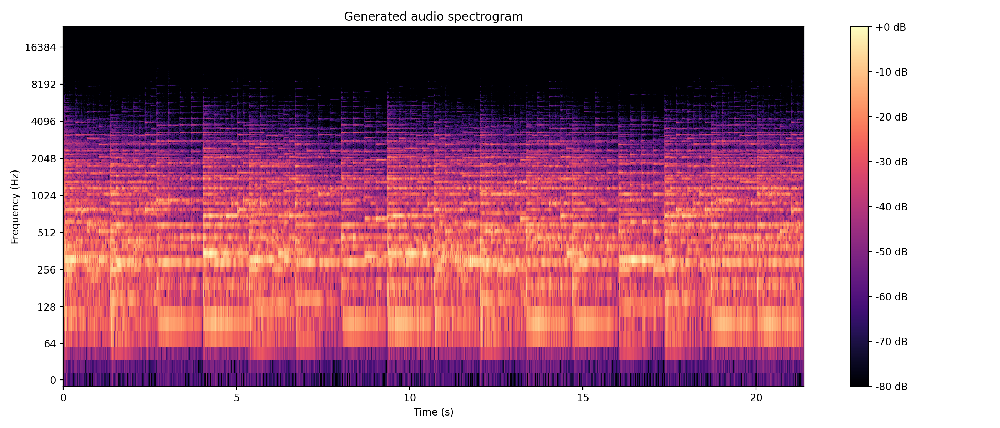
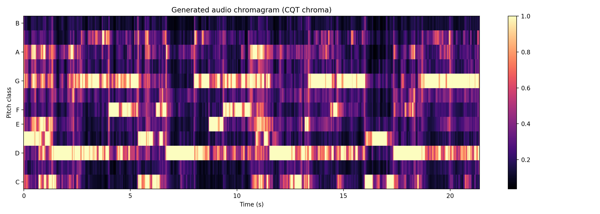
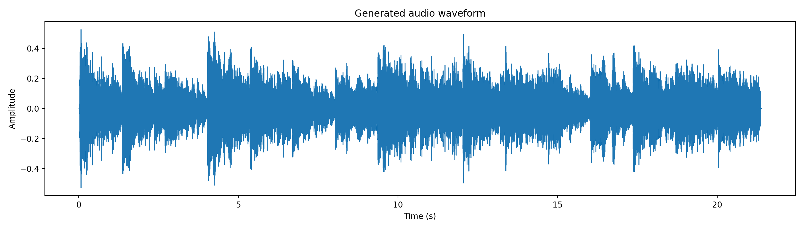

# Generated Audio Showcase / 生成音源の試聴と可視化

This page presents a generated audio sample from the Conformer-vMF prototype and its basic audio visualizations.  
このページでは、Conformer-vMF プロトタイプによる生成音源と、その基本的な音響可視化を掲載します。

## Audio preview / 音源試聴

<audio controls src="../audio/vMF_generated_sample.mp3"></audio>

[Listen to the generated audio / 生成音源を開く](../audio/vMF_generated_sample.mp3)

Audio metadata / 音源情報:

| Item | Value |
|---|---:|
| Duration / 長さ | 21.384 sec |
| Sample rate / サンプルレート | 48000 Hz |
| Analysis channel / 解析チャンネル | mono |

## Spectrogram / スペクトログラム

The spectrogram shows how frequency energy changes over time.  
スペクトログラムは、時間に沿って周波数成分の強さがどのように変化するかを示します。

## Chromagram / クロマ図

The chromagram shows the activity of the 12 pitch classes over time.  
クロマ図は、C から B までの 12 音高クラスの活動が時間に沿ってどのように変化するかを示します。

## Waveform / 波形

The waveform gives a simple overview of amplitude changes.  
波形は、音量変化の概要を確認するための図です。

## Note / 注記

This audio is provided as an example output of the research prototype.  
この音源は、研究プロトタイプの生成例として掲載しています。

The spectrogram and chromagram are descriptive visualizations and are not subjective listening evaluations.  
スペクトログラムとクロマ図は、音響的特徴を確認するための記述的可視化であり、主観評価そのものではありません。
